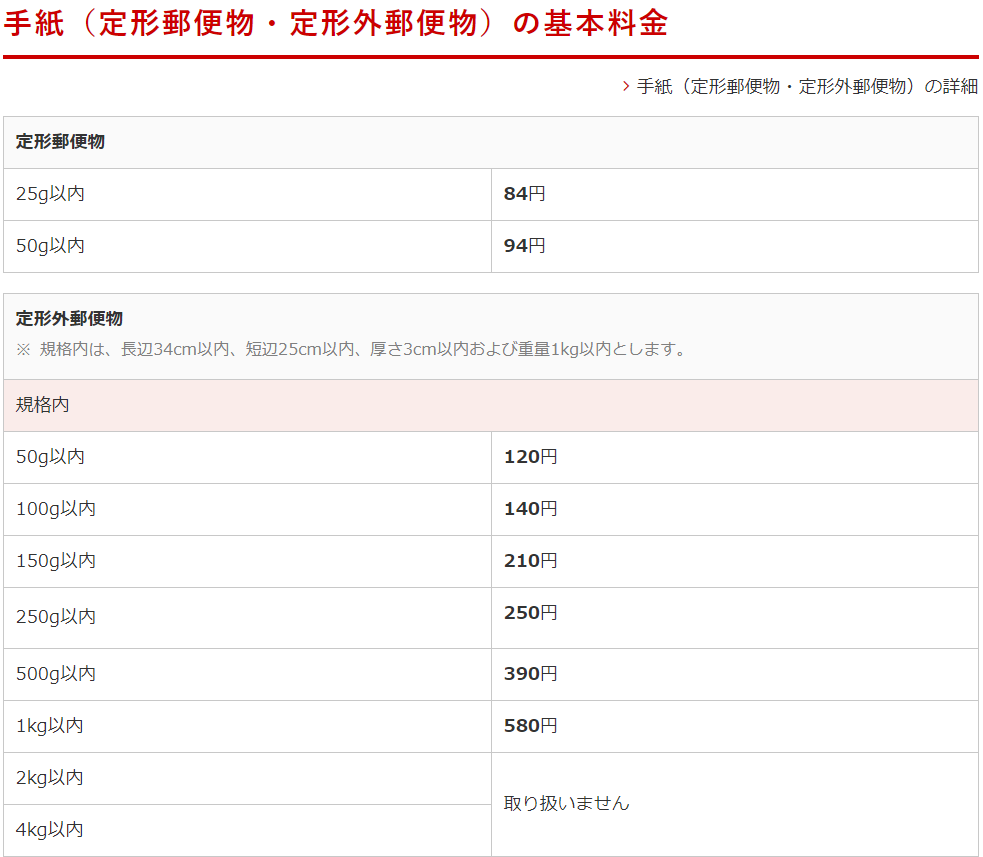

# 事務関連マニュアル
## 休日出勤について
前日の昼まで、上長と相談のうえ、社長へ個別に申請します。

**休日出勤のタイムカードの打刻漏れ**には特に注意してください。最悪、認められ
ないケースも発生するので、慎重に対応をお願いします。
## 経費の清算について
主な摘要項目は次のとおりです。
- 資料代
- 通信費
- 消耗品費
## 宅配便の発送について

## 電話、来客対応について
## ゴミ収集について
## プリンタについて
プリンタはプリンではありません！
## 大容量データの送受信について
VSCodeでコミットする。
mainブランチのコミットを取り込む